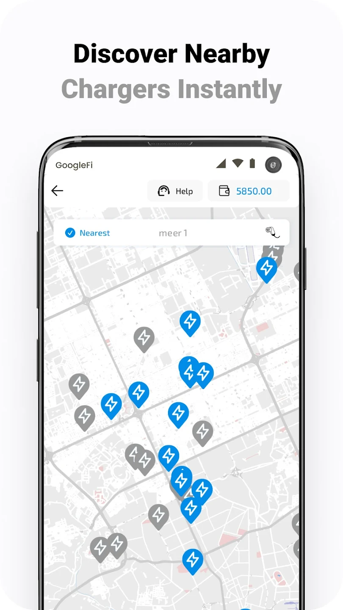
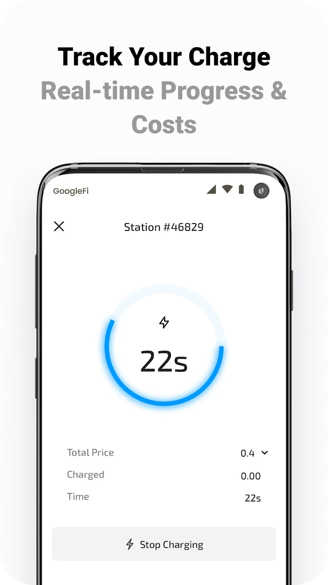
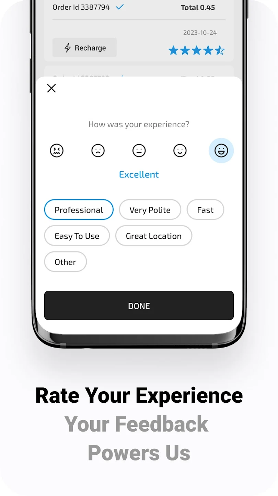

<p align="center">
  
</p>

<h1 align="center">Open EV Charge — Android App</h1>
<p align="center">⚡Powerly EV charging app — manage chargers, enable peer-to-peer sharing, integrate payments, and launch your smart energy services, all powered by the Powerly platform.</p>

---

[](LICENSE)
[](https://github.com/powerly-ev/open-ev-charge-android-app/issues)
[](https://github.com/powerly-ev/open-ev-charge-android-app/releases)
[](https://github.com/powerly-ev/open-ev-charge-android-app/stargazers)

---

## 🧭 Table of Contents

- [About Powerly & Vision](#about-powerly--vision)
- [Features](#features)
- [Screenshots](#screenshots)
- [Architecture & Tech Stack](#architecture--tech-stack)
- [Getting Started](#getting-started)
    - [Prerequisites](#prerequisites)
    - [Installation](#installation)
    - [Running the App](#running-the-app)
    - [Testing](#testing)
- [Configuration & APIs](#configuration--apis)
- [Roadmap](#roadmap)
- [Contributing](#contributing)
- [License](#license)
- [Acknowledgments & Links](#acknowledgments--links)

---

## 🌐 About Powerly & Vision

**Powerly** is an open-source EV charging platform designed to make electric mobility accessible, scalable, and customizable.  
This Android app is part of that ecosystem, allowing businesses, fleet operators, municipalities, and individuals to launch **branded EV charging apps** in minutes.

🔌 Supports **open protocols** like **OCPP** and **OCPI**, ensuring seamless charger compatibility, roaming, and backend integrations.  
🌍 Features include **AI site planning**, **fleet tools**, **real-time analytics**, and **P2P charging** (share your private charger with others).

📖 Read more: [Powerly Open Source](https://www.powerly.app/open-source/)

---

## ✨ Features

- ⚡ White-label EV charging app template
- 🗺️ Charger discovery with filtering by connector type and availability
- 📡 Real-time session control & monitoring
- 📅 Booking and scheduling charging sessions
- 📊 Usage history, cost breakdown & billing
- 🤝 Peer-to-peer charging support for private chargers
- 🌐 Roaming & cross-network integration
- 🔌 OCPP & OCPI protocol support
- 🔑 Integration-ready with [Powerly API](https://api.powerly.app/docs/)

---

## 📷 Screenshots

| Home Screen | Map View | Charging Session |
|-------------|----------|------------------|
|  |  |  |

---

## 🏗 Architecture & Tech Stack

**Architecture:** Clean Architecture with MVVM

**Languages & Tools:**
- Kotlin
- Jetpack Compose
- Retrofit / OkHttp
- Coroutines
- Room / Local persistence
- Koin for dependency injection
- Google Maps SDK
- Fastlane & GitHub Actions (CI/CD)

📚 For deeper insights, add `docs/architecture.md` and link it here.

---

## 🚀 Getting Started

### 🧰 Prerequisites

Before building the project, make sure the following environment and configuration files are correctly set up:

#### 🔧 Build Flavors

The project includes two build flavors:

- **`default`** – a build **without Firebase**.
- **`gms`** – includes Google services (Crashlytics, Analytics, Messaging).
    - ✅ Requires a Firebase project and a `google-services.json` file placed in the `app/` directory.

#### 📦 Build Variants

The app supports the following build variants:

- **`debug`** – uses the test API environment.
- **`release`** – uses the production API environment with optimizations enabled
- **`preRelease`** – a debuggable production variant

#### 🔐 Required Secrets Files

You must create two property files in the project root:

- `secrets.debug.properties` – used for `debug` builds
- `secrets.production.properties` – used for `release` and `preRelease` builds

Or use only `secrets.default.properties`

Each file must define the following keys:

```properties
PLACES_API_KEY=your_google_places_api_key        # required for map functionality
STRIP_PUBLISHABLE_KEY=your_stripe_publishable_key # required for payments
API_BASE_URL=https://api.example.com             # base URL for test or production
API_API_KEY=your_api_key                         # API key for test or production
PRIVACY_POLICY_URL=https://example.com/privacy   # optional
TERMS_AND_CONDITIONS_URL=https://example.com/terms # optional
SUPPORT_NUMBER=" "                       # optional
```

#### 🧪 local.properties

In addition to the usual `sdk.dir`, `local.properties` must define package name and signing information:

```properties
PACKAGE_NAME=com.powerly.open

# Optional for debug signing
DEBUG_STORE_FILE=/path/to/debug.keystore
DEBUG_STORE_PASSWORD=your_debug_store_password
DEBUG_KEY_ALIAS=your_debug_alias
DEBUG_KEY_PASSWORD=your_debug_key_password

# Optional for release signing
RELEASE_STORE_FILE=/path/to/release.keystore
RELEASE_STORE_PASSWORD=your_release_store_password
RELEASE_KEY_ALIAS=your_release_alias
RELEASE_KEY_PASSWORD=your_release_key_password
```

---

### ⚙️ Installation

1. **Clone the repository:**

```bash
git clone https://github.com/powerly-ev/open-ev-charge-android-app.git
cd open-ev-charge-android-app
```

2. **Add configuration files:**

- Place `google-services.json` in the `app/` directory (for `gms` flavor).
- Add `secrets.debug.properties` and `secrets.production.properties` to the project root.
- Fill `local.properties` with package name and signing credentials (if required).

3. **Sync Gradle** in Android Studio to ensure dependencies and configurations are loaded.

4. **Build the desired flavor and variant:**

You can build any combination using Gradle tasks:

- `assembleDefaultDebug` – default flavor with debug environment
- `assembleDefaultRelease` – default flavor with production environment
- `assembleGmsDebug` – GMS flavor (requires Firebase) with test environment
- `assembleGmsRelease` – GMS flavor with production environment
- `assembleGmsPreRelease` – GMS flavor with debuggable production build

Example:

```bash
./gradlew assembleDefaultDebug
```

5. **Run the app** on an emulator or device from Android Studio, or install the APK from `app/build/outputs/apk/`.

---

✅ **Tip:** Use `preRelease` when you need production API behavior with debugging enabled — perfect for staging and QA.

---

## 🙌 Contributing

We welcome contributions!

1. Fork the repository
2. Create a new branch: `git checkout -b feature/your-feature`
3. Add your changes with tests
4. Commit and push: `git commit -m "Add feature"`
5. Open a Pull Request

---

## 📄 License

Distributed under the **Apache License 2.0**.  
See [LICENSE](LICENSE) for more information.

---

## 🔗 Acknowledgments & Links

- 🌐 Website: [https://www.powerly.app](https://www.powerly.app)
- 📘 API Docs: [https://api.powerly.app/docs/](https://api.powerly.app/docs/)
- 📱 iOS App: [https://github.com/powerly-ev/open-ev-charge-ios-app](https://github.com/powerly-ev/open-ev-charge-ios-app)
- 🛠 Powerly Open Source: [https://www.powerly.app/open-source/](https://www.powerly.app/open-source/)

---

<p align="center">🚀 Powering the future of electric mobility — with open source.</p>